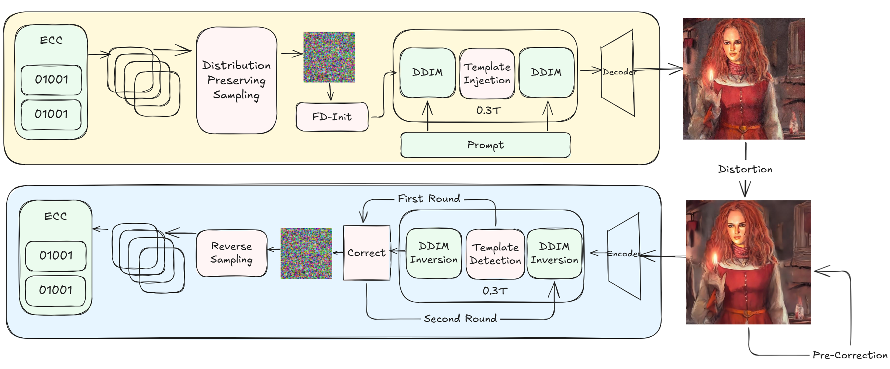

# 中期答辩

## 目录

- 研究背景与问题定位
- 项目方案设计与实现
- 实验评测与阶段成果
- 问题分析与后续计划

## 研究背景与问题定位

### 研究背景

**背景：**

- 扩散模型生成图像质量快速提升，AI 图像被广泛传播和二次编辑
- 生成图像的版权归属、内容溯源和责任认定需求增强
- 隐式水印可以在不影响视觉质量的前提下嵌入版权或身份信息

**理想水印方案应满足：**

- 不影响图像质量
- 可嵌入足够多的溯源信息
- 能抵抗压缩、裁剪、旋转、缩放等攻击
- **无需重新训练模型**，易部署

**其他：**

- 计划书/策划书内容

### 相关工作与技术分类

| 技术路线     | 代表方法                                             | 优点                     | 局限                     |
| ------------ | ---------------------------------------------------- | ------------------------ | ------------------------ |
| 后处理水印   | DWT/DCT、RivaGAN、StegaStamp                         | 与生成模型解耦，部署简单 | 强几何攻击下容易失效     |
| 模型微调水印 | Stable Signature、RoSteALS                           | 隐蔽性较好               | 训练成本高，跨模型迁移差 |
| 噪声嵌入水印 | Tree-Ring、Gaussian Shading、ShallowDiffuse、MaXsive | 无需训练，即插即用       | 容量和几何鲁棒性仍不足   |

选择方案：噪声嵌入，参考基线 Gaussian Shading

### 当前难题

1. **容量有限**
   - 有效载荷约 256 bits
   - 难以承载更丰富的溯源信息
   - 多数方案为检测型而非比特型

2. **几何攻击鲁棒性差**
   - 旋转、缩放会破坏像素级对应关系
   - DDIM Inversion 无法正确还原初始噪声
   - 准确率降至约 50%，接近随机猜测
3. **对于组合攻击、adversarial attack**
   - 准确率较低
4. **鲁棒性、水印容量、训练难度的平衡**


## 项目方案设计与实现

### 总体方案

核心思想：

- 在初始噪声频域中增强水印信号

- 在扩散中间步骤注入几何定位模板

- 在检测阶段进行缩放和旋转盲校正



### 具体方案

### 创新点一：频域初始噪声增强与容量扩展

**目标：** 将有效载荷从 256 bits 提升到 512 bits，同时保持鲁棒性。

**设计：**

- 将空间冗余因子从 hw=8 降到 hw=4
- 编码空间扩大到 1024 bits
- 使用 2× 重复码后，有效载荷为 512 bits
- 对初始噪声做 FFT，在中频段叠加水印模板

**频域增强公式：**

```text
W = FFT2(w)
T = FFT2(2m - 1)
W[mid_freq] = W[mid_freq] + λ · T[mid_freq]
w* = IFFT2(W)
```

**优势：**

- 中频比低频更不影响图像结构
- 中频比高频更能抵抗压缩和模糊
- 在容量翻倍后补偿冗余下降带来的鲁棒性损失

### 创新点二：低秩单步X形模板嵌入

**目标：** 为几何攻击检测提供定位基准。

**设计：**

- 借鉴 ShallowDiffuse 低秩理论
- 在 t*=0.3T 单步注入 X 形傅里叶模板
- 模板分布在 45° 和 135° 两条交叉方向
- 模板不承载主要水印内容，而是用于旋转 / 缩放定位

**注入策略演进：**

| 阶段     | 策略             | 效果                     |
| -------- | ---------------- | ------------------------ |
| 末端注入 | 最后 1—2 步注入  | 信号弱，不稳定           |
| 全步注入 | 50 步持续注入    | 信号强，但可能影响质量   |
| 当前方案 | t*=0.3T 单步注入 | 信号可检测，图像质量无损 |

### 创新点三：多级几何盲矫正

**目标：** 不知道攻击参数，也能恢复图像与原始水印空间的对齐关系。

**缩放校正：**

```text
检测黑边
  → 判断黑边是否对称
  → 若对称，认为是缩放攻击
  → 裁剪内容区域并 resize 回原尺寸
```

**旋转校正：**

```text
图像 → VAE Encode → DDIM Inversion → z_T_probe
  → FFT 幅度谱
  → 多半径角度剖面采样
  → 与 X 模板做环形交叉相关
  → 得到旋转角 θ
  → 像素空间逆旋转
```

## 完整过程：从编码到解码

**以 512 bits 水印为例：**

```text
1. 原始水印 b：512 bits
2. 重复码编码：[b | b] → 1024 bits
3. ChaCha20 加密：得到随机化比特 m
4. 空间冗余映射：每 bit 映射到 4×4 个潜变量位置
5. 截断高斯采样：
   m_i=0 → 负半轴采样
   m_i=1 → 正半轴采样
6. FFT 中频增强：增强初始噪声中的水印模板
7. 扩散生成：t*=0.3T 注入 X 形几何模板
8. 检测时：几何校正 + DDIM Inversion
9. 符号检测 + 解密 + 投票 + 重复码解码
10. 恢复 512 bits 水印
```

```text
原始水印前 8 bits：
  b = 10110010

重复码：
  b_encoded = 10110010 | 10110010

加密后：
  m = 011010...  由密钥决定

嵌入：
  m_i=0 → 对应 4×4 噪声块倾向负值
  m_i=1 → 对应 4×4 噪声块倾向正值
  同时在 FFT 中频段增强该模式

攻击：
  图像被 JPEG 压缩 + 旋转 15°

检测：
  X 模板估计旋转角 ≈ 15°
  像素空间逆旋转
  DDIM Inversion 还原 z_T
  符号检测 + 解密 + 投票
  恢复 b ≈ 10110010
```

## 实验评测与阶段性成果

### 实验设置与攻击库

**攻击库：6 大类 17 项**

| 攻击类别 | 攻击内容                          |
| -------- | --------------------------------- |
| 降质攻击 | JPEG、模糊、噪声、重采样          |
| 裁剪攻击 | crop 80%、crop 60%                |
| 几何攻击 | rotate 15°、rotate 45°、scale 75% |
| 光度扰动 | brightness、color jitter          |
| 对抗扰动 | FGSM                              |
| 组合攻击 | Stirmark RST、Stirmark All        |

**基线：**

1. Gaussian Shading
2. DwtDct
3. Ours（FDW）

**具体实验报告可见另一份文档**

## 问题分析与后续计划

### 当前存在问题与原因分析

| 问题                        | 当前表现                          | 原因分析                                           |
| --------------------------- | --------------------------------- | -------------------------------------------------- |
| Stirmark 组合攻击鲁棒性不足 | Acc 约 0.51                       | 随机平移破坏黑边对称性，叠加变换降低模板检测信噪比 |
| 跨模型兼容性尚未充分验证    | 目前主要在 SD 2.1-base 上测试     | 不同模型 VAE 与采样轨迹存在差异                    |
| 容量进一步扩展存在瓶颈      | 当前 512 bits，继续扩容会降低冗余 | 简单重复码纠错效率有限                             |
| 安全边界尚需明确            | 自适应攻击、串谋攻击未系统测试    | 需要补充安全性评估                                 |
| 测试规模不够大              | 测试规模在 N=10                   | 尚缺少GPU资源                                      |

### 解决方案与后续研究计划

**近期计划：2026.05—2026.07**

1. Stirmark 组合攻击优化
   - 探索基于频域相位的平移估计
   - 适当增强模板注入强度

2. 跨模型迁移验证
   - 分析不同 VAE 对 DDIM Inversion 的影响

3. 水印容量提升的进一步探索

4. 尝试更多的纠错码

5. 探索对已有图像的水印添加功能

6. 探索如何设计更好的初始频域增强，同时保持高斯采样尽量不变

**中后期计划：2026.07—2026.11**

- 大规模消融实验
- 安全性评估
- 系统搭建
- 论文撰写与投稿

### 经费使用情况与安排

| 开支科目           | 预算 | 当前情况     | 后续安排               |
| ------------------ | ---: | ------------ | ---------------------- |
| 计算、分析、测试费 | 4000 | 暂未使用     | 跨模型验证、消融实验   |
| 会议、差旅费       | 1000 | 暂未集中使用 | 投稿和会议交流阶段使用 |
| 文献检索费         |  200 | 少量使用     | 后续文献补充           |
| 论文出版费         |  500 | 暂未使用     | 论文录用后使用         |
| 材料费             |  300 | 少量使用     | 实验杂项               |

### 中期结果总结

**中期工作总结：**

- 完成文献调研与基线复现
- 提出核心大比特容量隐式水印方案
- 实现频域增强、低秩模板注入、多级几何盲校正
- 构建了标准化攻击库和自动化评测管线
- 在 SD 2.1-base 上完成 N=10 benchmark

**核心结果：**

| 指标      |       GS |  FDW（ours） |
| --------- | -------: | -----------: |
| 有效载荷  | 256 bits | **512 bits** |
| JPEG Q=25 |    0.909 |    **1.000** |
| 高斯模糊  |    0.874 |    **0.985** |
| 旋转 15°  |    0.504 |    **0.998** |
| 旋转 45°  |    0.486 |        1.000 |
| 缩放 75%  |    0.519 |        1.000 |

Q: 高斯blur

